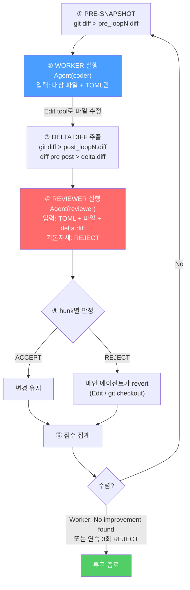
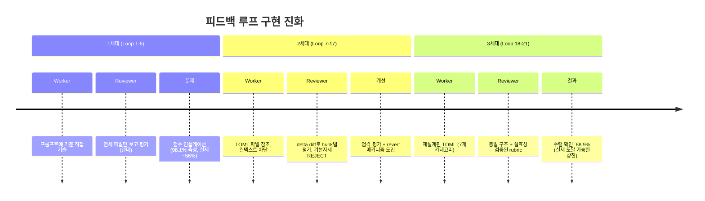
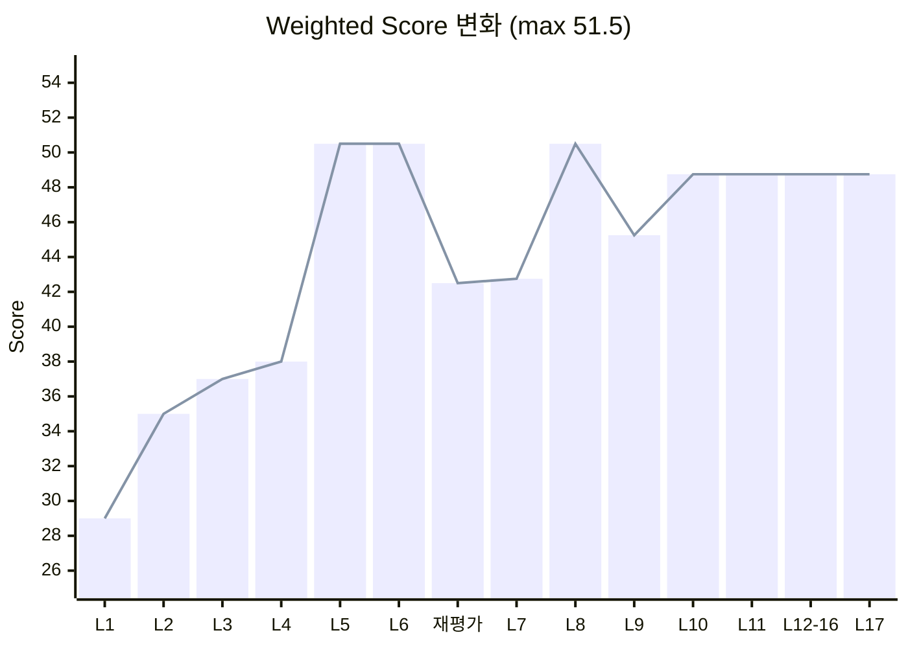
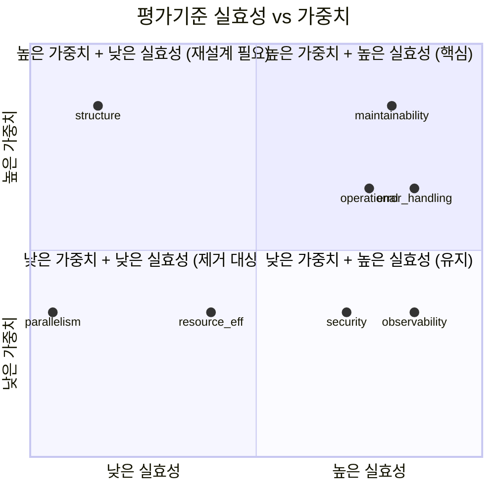

```mermaid
gantt
    title 21회 루프 ACCEPT/REJECT 추이
    dateFormat X
    axisFormat %s

    section 1세대 (관대)
    L1 ACCEPT           :done, 0, 1
    L2 ACCEPT           :done, 1, 2
    L3 ACCEPT           :done, 2, 3
    L4 ACCEPT           :done, 3, 4
    L5 ACCEPT           :done, 4, 5
    L6 ACCEPT (수렴)    :done, 5, 6

    section 2세대 (엄격)
    L7  5/7 ACCEPT      :done, 6, 7
    L8  4/5 ACCEPT      :done, 7, 8
    L9  3/5 ACCEPT      :done, 8, 9
    L10 8/9 ACCEPT      :done, 9, 10
    L11 전체 REJECT     :crit, 10, 11
    L12 ACCEPT          :done, 11, 12
    L13 전체 REJECT     :crit, 12, 13
    L14 전체 REJECT     :crit, 13, 14
    L15 전체 REJECT     :crit, 14, 15
    L16 Partial         :active, 15, 16
    L17 수렴            :milestone, 16, 17

    section 3세대 (재설계)
    L18 2/3 ACCEPT      :done, 17, 18
    L19 2/2 ACCEPT      :done, 18, 19
    L20 REJECT          :crit, 19, 20
    L21 수렴            :milestone, 20, 21
```

# DAG Autoresearch 피드백 루프 후기

## 1. 프로젝트 개요

Karpathy의 [autoresearch](https://github.com/karpathy/autoresearch) 패턴을 차용한 **자동 코드 품질 개선 루프**를 구현/운영한 기록.

**대상**: Airflow DAG 파일 1개 (`DAG_file.py`)
**총 루프**: 21회 (Loop 1~21)

---

## 2. 피드백 루프 구현체

### 2.1 사용 기술 스택

외부 프레임워크 없이 **Claude Code 내장 기능만**으로 구현.

| 구성 요소 | 구현체 | 역할 |
|-----------|--------|------|
| Worker | `Agent` tool, `subagent_type: "coder"` | DAG 파일 수정 |
| Reviewer | `Agent` tool, `subagent_type: "reviewer"` | 변경 평가 / 점수 / revert 판정 |
| 평가기준 | `review_criteria.toml` (Write tool로 생성) | Worker/Reviewer 공통 기준 |
| 상태 관리 | `git diff`, `git stash`, `/tmp/*.diff` 파일 | 변경 추적 / 롤백 |
| 오케스트레이션 | 메인 에이전트 (Opus)가 직접 수행 | 루프 제어, revert 실행, 수렴 판단 |

### 2.2 루프 1회 실행 구조

**텍스트 다이어그램:**

```
╔═══════════════════════════════════════════════════════════════╗
║                    메인 에이전트 (Orchestrator)                  ║
╠═══════════════════════════════════════════════════════════════╣
║                                                               ║
║  ① PRE-SNAPSHOT                                               ║
║     $ git diff DAG.py > /tmp/pre_loopN.diff                  ║
║                                                               ║
║  ② WORKER 실행 ─────────────────────────────┐                ║
║     Agent(coder, "dag-worker-N")             │                ║
║     입력: 대상 파일 + TOML 기준만            │                ║
║     (컨텍스트 차단 = 편향 방지)              │                ║
║     출력: Edit tool로 파일 직접 수정          │                ║
║                                              ▼                ║
║  ③ DELTA DIFF 추출                                            ║
║     $ git diff DAG.py > /tmp/post_loopN.diff                 ║
║     $ diff pre post > /tmp/workerN_delta.diff                ║
║                                              │                ║
║  ④ REVIEWER 실행 ───────────────────────────┘                ║
║     Agent(reviewer, "dag-reviewer-N")                         ║
║     입력: TOML + 현재 파일 + delta.diff                       ║
║     기본자세: REJECT                                          ║
║     출력: hunk별 ACCEPT/REJECT + 카테고리 점수                 ║
║                                              │                ║
║  ⑤ REVERT (메인 에이전트가 직접 수행)         │                ║
║     REJECT된 hunk → Edit 또는 git checkout    │                ║
║     점수 집계 → 다음 루프 진행 여부 판단       ▼                ║
║                                                               ║
║  ⑥ 수렴 판단                                                  ║
║     Worker "No improvement found" 선언 → 종료                 ║
║     연속 3회 REJECT → 해당 카테고리 수렴                       ║
╚═══════════════════════════════════════════════════════════════╝
```

**Mermaid 다이어그램:**



### 2.3 구현 진화 과정 (3세대)

**텍스트 다이어그램:**

```
  1세대 (Loop 1-6)          2세대 (Loop 7-17)           3세대 (Loop 18-21)
  ─────────────────      ─────────────────────       ──────────────────────
  Worker: 프롬프트에      Worker: TOML 파일 참조       Worker: 재설계된 TOML
  기준 직접 기술                                       (structure→code_readability,
                                                       parallelism 제거)

  Reviewer: 전체 파일     Reviewer: delta diff로       Reviewer: 동일 + 재설계된
  보고 평가               hunk별 평가                  rubric으로 평가
  (관대함)                (기본자세 REJECT)

  상태관리: 없음          상태관리: git diff            상태관리: 동일
                          /tmp/*.diff 파일

  문제점                  개선점                       개선점
  ├─ 점수 인플레이션      ├─ 엄격한 평가               ├─ 실효성 없는 기준 제거
  ├─ ACCEPT 과다          ├─ 증분 가치 평가            ├─ 도달 불가능한 만점 해소
  └─ 98.1%로 측정         ├─ revert 메커니즘           └─ 7개 카테고리로 축소
     (실제 ~56%)          └─ 42.5%로 재측정(실제)
```

**Mermaid 다이어그램:**



### 2.4 핵심 설계 결정 5가지

| # | 결정 | 이유 |
|---|------|------|
| 1 | **Worker/Reviewer에게 컨텍스트 차단** | TOML 기준 + 대상 파일만 전달. 이전 루프 이력, 유저 의도 등 차단하여 평가 편향 방지 |
| 2 | **Reviewer 기본자세 = REJECT** | `default_stance = "REJECT"`, `min_justification_lines = 2`. 초기 ACCEPT 과다 문제 해결 |
| 3 | **메인 에이전트가 revert 직접 수행** | Reviewer는 판정만, 실제 revert는 Orchestrator가 `Edit`/`git checkout`으로 실행 |
| 4 | **`mode: "bypassPermissions"`** | Loop 7부터 적용. 파일 읽기/수정 시 사용자 승인 없이 자동 진행 (루프 속도 확보) |
| 5 | **평가기준을 TOML로 외부화** | Worker/Reviewer 간 기준 일관성 보장. 기준 변경 시 파일만 수정하면 됨 |

### 2.5 review_criteria.toml 구조

```toml
[meta]
target = "airflow/dags/DAG_file.py"

[constraints]
task_id_preservation = true       # task_id 변경 금지 (MWAA history)
single_file = true                # 대상 파일만 수정
functional_equivalence = true     # DAG 동작 변경 금지
no_new_dependencies = true        # 새 import 추가 금지

[scoring]
max_raw = 40          # 8 categories * 5
max_weighted = 51.5   # weighted sum

[categories.structure]
weight = 1.75
description = "TaskGroup hierarchy, task count, dependency graph clarity"
core_value = "readability, intuitiveness"

# ... (8개 카테고리)

[review_policy]
default_stance = "REJECT"         # 기본 = REJECT
review_unit = "per_hunk"          # hunk 단위 평가
min_justification_lines = 2       # ACCEPT 시 2줄 이상 근거 필수

[review_policy.reject_reasons]
cosmetic = "Change is cosmetic-only"
complexity = "Adds complexity without measurable improvement"
constraint = "Violates a constraint"
debatable = "Improvement is debatable or unconvincing"
regression = "Regresses another category"
```

---

## 3. 중요 변화점

### 3.1 Reviewer 강도 변화

```
점수
51.5 ┤
     │            ┌──── 1세대: 관대한 Reviewer
50.5 ┤ ●─●─●─●─●─●     (전체 파일 평가, ACCEPT 과다)
     │            │
48.75┤            │  ●─●─●─●─●─●─●  ← 2세대 최종 수렴
     │            │
45.25┤            │     ●
     │            │    ╱
42.75┤            │   ●  ← 2세대: 엄격한 Reviewer
42.50┤            │  ●    (hunk별 평가, REJECT 기본)
     │            ↓  ↑
     │         재평가 (cold baseline)
     │
29.0 ┤ ○ ← origin/main baseline (Before)
     │
     └──┬──┬──┬──┬──┬──┬──┬──┬──┬──┬──┬──┬──┬──┬──┬──┬──
        1  2  3  4  5  6  7  8  9  10 11 12 13 14 15 16 17
                            Loop #
```



### 3.2 평가기준 진화

| 시점 | 변화 | 이유 |
|------|------|------|
| 초기 | 8개 카테고리, 모든 가중치 1.0x | 범용적 기준 |
| Loop 5 | Structure/Maintainability 가중치 **1.75x**로 상향 | 유저: "가장 핵심적인건 코드가독성, 운영효율성" |
| Loop 7 | Reviewer 기본자세 REJECT + hunk별 평가 도입 | 유저: "왜 자꾸 ACCEPT 하는거야?" |
| Loop 7 | TOML 파일로 기준 외부화 | 유저: "기준을 toml로 내려서 명시하고" |
| 재평가 | cold baseline 측정: 50.5 → **42.5** | 이전 점수가 인플레이션이었음을 확인 |
| Loop 18 | `structure` → `code_readability`로 교체 | description("DAG 구조")과 core_value("가독성")가 서로 다른 것을 가리킴 |
| Loop 18 | `parallelism` **제거** | 데이터 의존성상 개선 불가 → 도달 불가능한 만점 |
| Loop 19 | `resource_efficiency` 재정의 | "컨테이너 사이징" → "Airflow worker/scheduler 부하" 관점으로 |

### 3.3 평가기준 실효성 분석

```
  실효성
  높음 ██████████████████████████████████  error_handling (2→5, +3)
       ██████████████████████████████████  observability  (2→5, +3)
       ██████████████████████████████████  maintainability(3→5, +2)
       ██████████████████████████████████  operational    (3→5, +2)
       ██████████████████████████████████  security       (3→5, +2)
  중간 ████████████████░░░░░░░░░░░░░░░░░  resource_eff   (3→4, +1) speculative
  낮음 █████░░░░░░░░░░░░░░░░░░░░░░░░░░░░  structure      (3→4, 5회 시도 전부 reject)
  없음 ░░░░░░░░░░░░░░░░░░░░░░░░░░░░░░░░░  parallelism    (3→4, 개선 불가)
```



---

## 4. 재미있던 점: "4 Partial+"

Loop 18에서 Reviewer가 기존 정수 체계에 없던 **반점(4.5)**을 줬다.

> | Category | Prev | New |
> |----------|------|-----|
> | code_readability | 4 | **4 (partial +)** |
> | maintainability | 4 | **4 (partial +)** |

Worker가 `_s3_sync_prefix` 위치 이동, `b` → `build_tasks` 변수명 개선 등의 변경을 했는데, Reviewer 입장에서:

- **4보다는 확실히 좋다** — cosmetic이 아닌 실질적 개선
- **5를 주기엔 부족하다** — "zero improvement possible"이라고 선언할 수준은 아님

결국 **정수 기준 체계의 해상도 한계**에서 Reviewer가 자발적으로 만들어낸 채점 형태. 이 partial+ 점수들은 최종 수렴 시에도 4로 남아, "비cosmetic 개선이 더 이상 존재하지 않음"이 확인되는 근거가 되었다.

---

## 5. 총 성과 변화

### 5.1 점수 변화

**첫 번째 rubric (8 categories, Loop 7-17):**

```
                Before          After           변화
  Raw Score     22/40    ───▶   38/40           +72.7%
  Weighted      29.0/51.5 ──▶   48.75/51.5      +68.1%
```

**두 번째 rubric (7 categories, Loop 18-21 최종):**

```
  Raw Score     31.5/35     (90.0%)
  Weighted      42.25/47.5  (88.9%)
```

### 5.2 카테고리별 변화

```
  Category           Before  After   Delta
  ─────────────────  ──────  ──────  ──────
  error_handling        2   ▓▓▓▓▓  5     +3  ███████████████
  observability         2   ▓▓▓▓▓  5     +3  ███████████████
  maintainability       3   ▓▓▓▓▓  5     +2  ██████████
  operational           3   ▓▓▓▓▓  5     +2  ██████████
  security              3   ▓▓▓▓▓  5     +2  ██████████
  resource_efficiency   3   ▓▓▓▓░  4→5   +1→2 █████ → ██████████
  structure/readability 3   ▓▓▓▓░  4     +1  █████  (수렴)
  parallelism           3   ▓▓▓▓░  4     +1  █████  (데이터 제약)
```

```mermaid
%%{init: {'theme': 'dark'}}%%
radar
    title "카테고리별 점수 변화 (1-5)"

    axis error_handling, observability, maintainability, operational, security, resource_eff, structure, parallelism

    curve "Before (origin/main)" { 2, 2, 3, 3, 3, 3, 3, 3 }
    curve "After (최종)" { 5, 5, 5, 5, 5, 5, 4, 4 }
```

### 5.3 코드 변화

| 지표 | Before | After | Delta |
|------|--------|-------|-------|
| 총 라인 | 522 | 535 | **+13 (+2.5%)** |
| **실행 코드** | 426 | **364** | **-62 (-14.6%)** |
| 주석/문서 | 96 | 171 | +75 (+78%) |
| `conn_id=` 반복 | 34회 | **2회** | **-94%** |
| `autocommit=` 반복 | 25회 | **1회** | **-96%** |
| Operator 직접 생성 | 43회 | **11회** | -74% |
| 함수 수 | 2개 | 8개 (factory) | +6 |

### 5.4 주요 개선 내역

| 영역 | Before | After |
|------|--------|-------|
| Phase 구성 | 3-phase 직렬 | **2-phase** (테이블별 즉시 시작) |
| retry 전략 | 고정 2회, 5분 | exponential backoff, 유형별 분화 |
| timeout | 전체 30분 동일 | **3-tier** (SF 20m, unload 15m, EKS 30m) |
| max_active_runs | **10** | **2** |
| SLA 모니터링 | 없음 | Phase 1 50m + 전체 2h + Slack 알림 |
| trigger_rule (end) | none_failed | **none_failed_min_one_success** |
| shell injection 방어 | 없음 | **shlex.quote()** |
| shell 에러 처리 | 없음 | **set -euo pipefail** |
| EKS 리소스 분화 | 전체 동일 | catalog/relationship → small |

### 5.5 루프별 ACCEPT/REJECT 추이

```
  Loop  Verdict          주요 변경
  ────  ───────────────  ──────────────────────────────────────
   1    ACCEPT           TypedDict, 상수 네이밍, WHY 코멘트
   2    ACCEPT           max_active_runs, dagrun_timeout
   3    ACCEPT           _sf_task_group() 헬퍼
   4    ACCEPT           Tiered timeout, EKS retries=3
   5    ACCEPT           _sf_build_task(), _sf_unload_task() factory
   6    ACCEPT (수렴)    pip+S3 병렬화, echo 로깅 — 점수 변동 없음
   ─── 재평가: 50.5 → 42.5 (cold baseline) ───
   7    5/7 ACCEPT       _EKS_POD_DEFAULTS, set -euo pipefail
   8    4/5 ACCEPT       _sla_miss_callback, retries=3, trigger_rule
   9    3/5 ACCEPT       shlex.quote(), fanout 패턴
  10    8/9 ACCEPT       EKS 리소스 프리셋, SLA 확장
  11    전체 REJECT      미사용 반환값 추가 → dead code
  12    ACCEPT           polymorphic type 제거, logger.exception
  13    전체 REJECT      데이터 이동 → config/logic 분리 파괴
  14    전체 REJECT      call graph 주석 → cosmetic
  15    전체 REJECT      _sf_build_task 제거 → maintainability 회귀
  16    Partial ACCEPT   entity_relationship→small만 ACCEPT
  17    수렴 선언        Worker: "No improvement found"
  ─── rubric 재설계: 8→7 카테고리 ───
  18    2/3 ACCEPT       _s3_sync_prefix 위치, b→build_tasks
  19    2/2 ACCEPT       logger.warning(SLA), max_active_tasks=16
  20    REJECT           shell 문법 주석 → cosmetic
  21    수렴 선언        4개 카테고리 CONVERGED, 변경 없음
```



---

## 6. 교훈

1. **Reviewer의 엄격함이 루프 품질을 결정한다.** 1세대의 관대한 Reviewer는 점수 인플레이션을 유발했고, 2세대의 "기본자세 REJECT + hunk별 평가"로 전환한 뒤에야 실질적 개선이 측정 가능해졌다.

2. **평가기준도 개선 대상이다.** 21회 루프 중 rubric 자체를 2번 재설계했다. 도달 불가능한 만점(parallelism), 모호한 정의(structure), 실효성 없는 기준이 루프를 헛돌게 만든다.

3. **컨텍스트 차단이 공정한 평가를 만든다.** Worker/Reviewer에게 이전 루프 이력이나 유저 의도를 전달하지 않고, TOML + 대상 파일만 주었을 때 가장 객관적인 평가가 나왔다.

4. **수렴은 자연스럽게 온다.** 구조적 변경이 다른 카테고리를 회귀시키기 시작하면, Worker가 스스로 "No improvement found"를 선언한다. 이 시점이 파일 범위 내 개선의 실제 한계.

5. **정수 채점의 해상도 한계**가 있다. "4 Partial+"가 보여주듯, 1~5 정수 체계에서 미묘한 개선을 포착하기 어렵다. 다만 이 granularity 부족이 오히려 cosmetic 변경을 걸러내는 역할도 했다.
